Introduction to Murano
======================
 
What is Murano?
---------------

.. raw:: html

    

Murano is an application catalog project on OpenStack. This project is open source and managed
according OpenStack community rules.

.. note:: **Murano mission statement from OpenStack wiki**

   The Murano Project introduces an application catalog to OpenStack, enabling application developers and cloud
   administrators to publish various cloud-ready applications in a browsable categorized catalog.
   Cloud users can then use the catalog to compose reliable application environments with the push of a button.

Murano provides UI and API which allows to compose and deploy composite environments on the Application
abstraction level and then manage their lifecycles. 
Murano is focused on user experience and provides an easy way to
browse application catalog, find and filter applications in it by browsing via categories or by using free text search.

Murano UI is called **Murano Dashboard**. It is pluggable into Horizon (standard Open Stack UI).
Murano API consists of:

* JSON-based Murano API, that duplicates the functionality of Murano Dashboard
* Command-line interface for Murano. It is a wrapper around Murano JSON API
* MuranoPL - a YAML-based DSL (Domain Specific Language) that describes workflow that orchestrates creation and configuration of various components and resources.  MuranoPL is executed by central Murano component ``murano-engine``.
 
The big yet simplified picture that renders Murano components and basic interactions between them can be found here: https://software.mirantis.com/wp-content/uploads/2013/10/Murano-Block-Diagram.gif

Application, Environment and Package are the key Murano notions. 
Murano Dashboard offers panels to manage Applications, Environments and Packages.  
This tutorial will define and explain what are Application, Environment and Package while walking through the Murano Dashboard.

Murano UI Overview
------------------

Applications
~~~~~~~~~~~~

The main Murano UI page is an Application page (Murano -> Application Catalog -> Applications), 
where users can browse applications available for the tenant.

**Murano application** installs and manages an arbitrary software like Tomcat, MySQL, Windows ActiveDirectory  
on top of virtual machine instance. It consists of:

* Arbitrary software resources such as shell scripts, various config or properties files or even software binary distributives 
* Murano application code written on MuranoPL (workflows)
* Text files in special Murano format that specify UI definitions, Murano application manifest.
* Application logo 

**Workflows** usually contain a set of instructions to provision OpenStack resources: VMs, networks, subnets, floating IPs and volumes.
As soon as infrastructure resources are provisioned Murano workflows will orchestrate software components installation.

It is important to note that Murano uses Heat to provision OpenStack resources. 

Murano can also use Heat for software components installation via Heat Software orchestration. 
If used together with Heat Software Orchestration, Murano can install software not only on VM instance, but also on a bare metal server. 

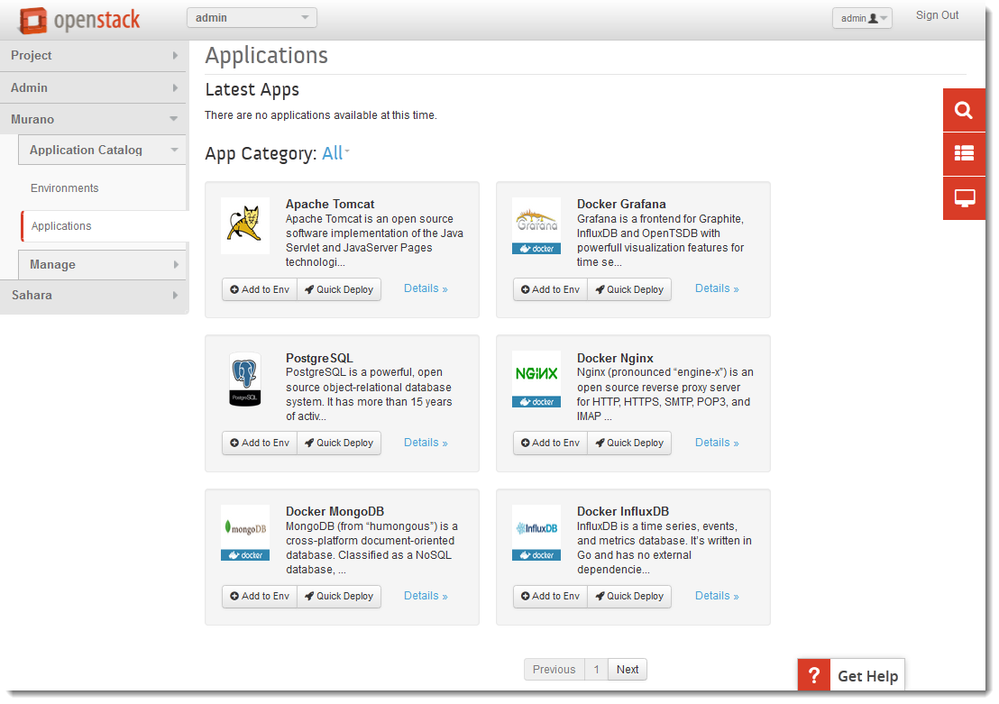

Each application tile has an icon, a name, short description and detailed information. There are also two buttons on each 
application tile which defines actions which you can do with the application. 
Details link leads to the detailed application description page where users can find more information about the application.

Let's take a look at the Details page of ``Tomcat`` application:
This application is responsible for creating a new instance, configuring its security group rules, and installing Tomcat on it. 

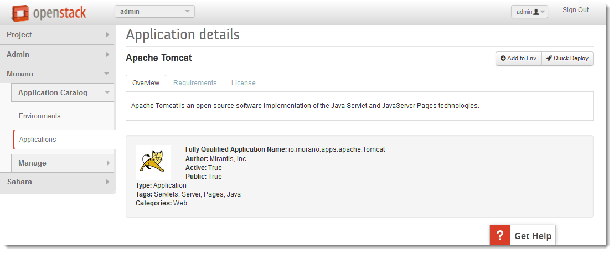

The most interesting parts of it are ``Categories: Web`` and ``Tags: Servlets, Server, Pages, Java``

Both application Categories and Tags are a markers, which you can search an application by.
For example if you need a database, you may search the Application catalog by the category 'Database'.
The search may return such applications as MySQL, PostgreSQL, etc.

The difference between Tags and Categories is that Tags are set by Application developer, 
while Categories are managed by Murano Administrator.

The screenshot below displays sample list of Categories:

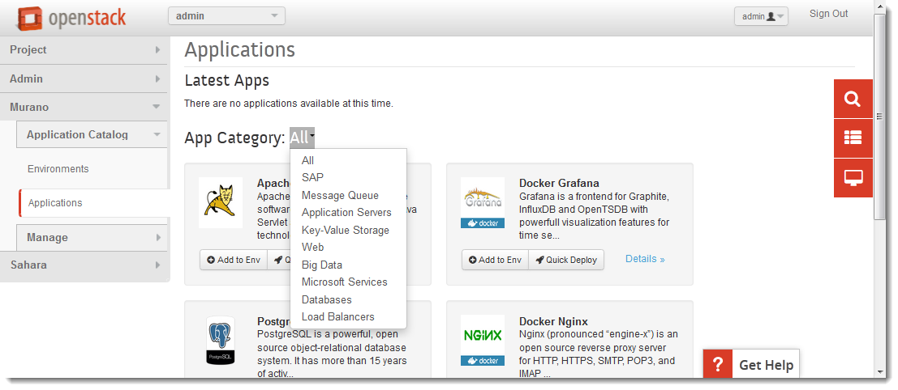

Environments
~~~~~~~~~~~~

**Environment** is a set of applications managed by a single tenant. 
Appplications within single environment may comprise complex configuration, 
while applications in different environmetns are always independent from each other.
Environment is a logical aggregation of multiple applications that binds them together.

The best way to understand what environment is, is it to look at the example. 

*Let's say that we have a QA team that needs to test famous Petstore web-application. 
Petstore needs to be deployed on a Web Server, such as Tomcat. It also stores and retrieves data from
a database, such as PostgreSQL. QA team performs weekly tests on in-development version 1.1.X: 
Petstore_SNAPSHOT_1.1.X.war.*

*Let's suppose that we also have a UAT group of end users.
UAT group is going to work with a stable release of Petstore v. 1.0: Petstore_RELEASE_1.0.war for duration of a month 
and provide a feedback about user experience.*

In a situation like that, we need to have two separate installations of Petstore. 
QA team needs their own QA infrastructure that consists of dedicated Tomcat and PostgreSQL servers.
UAT team needs separate from QA, independent infrastructure, that also consists of Tomcat and PostgreSQL servers.

While QA Tomcat interacts with QA PostgreSQL, QA servers are unaware of UAT servers, and vice versa.
QA and UAT infrastructures are completely independent from each other.

We will create two Murano environments: one for QA, the other one for UAT so that to satisfy these requirements.

Environments panel has a "Create environment" button, that creates environments. 

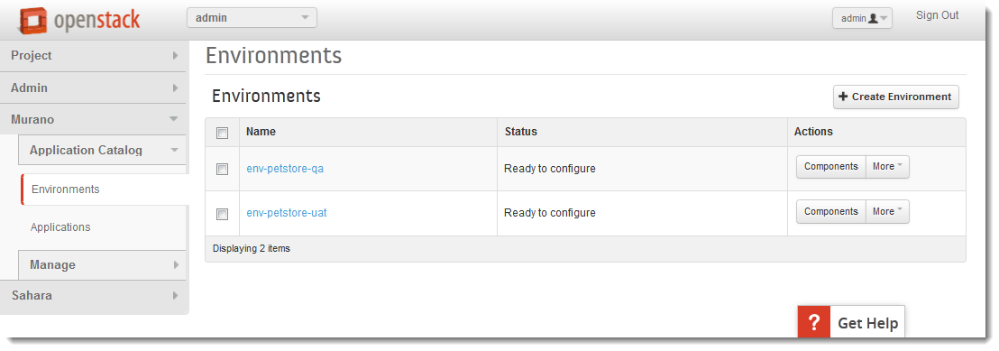

* ``env-petstore-qa`` is a QA environment
* ``env-petstore-uat`` ia a UAT environment

At this stage these environments are mere configuration within Murano.

You may click on a name of an environment to view what applications it consists of. 
Newly created environment is empty. It has nothing except for its name. 

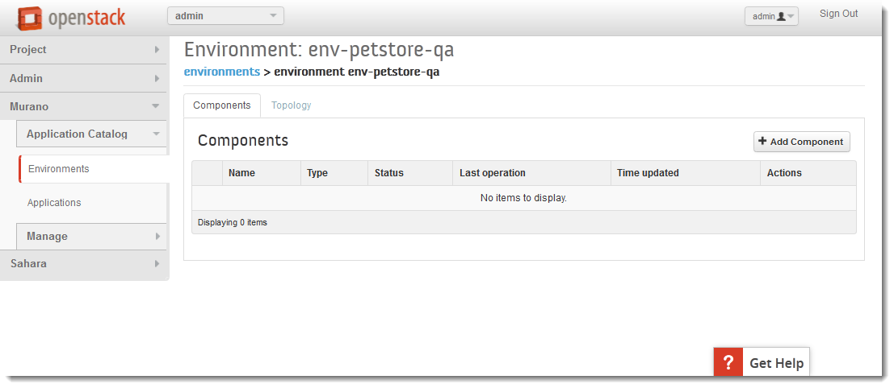

Once the environment is created, we can add both Tomcat and PostgreSQL applications to it.
Click on the "Add Component" button, select Tomcat application, and enter parameters for Tomcat application.
These parameters vary from application to application. Most of the applications ask name, instance flavor, 
instance image, etc. Database application will probably ask you to set the username and password.  

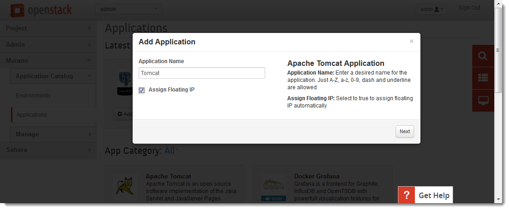

.. warning:: Always assume that you need an instance image that comes with pre-installed murano agent, unless you deploy non-standard application that requires specific image. Read more on this here: :ref:`images_label` 

Usually the name of the image itself implies that it is Murano-ready, as it is shown in the screenshot below.
The image we use for the example is *"Ubuntu 14.04 LTS x64 (pre installed murano agent)"*

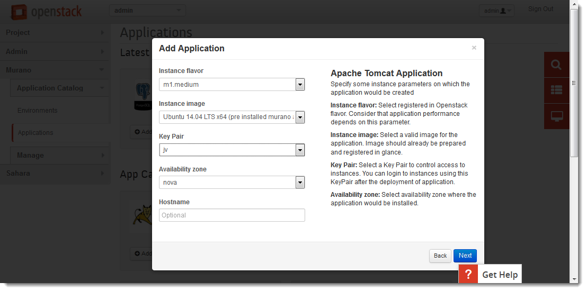

When Tomcat and PostgresQL applications are just added to the env-petstore-qa their state is ``"Configuring"``:

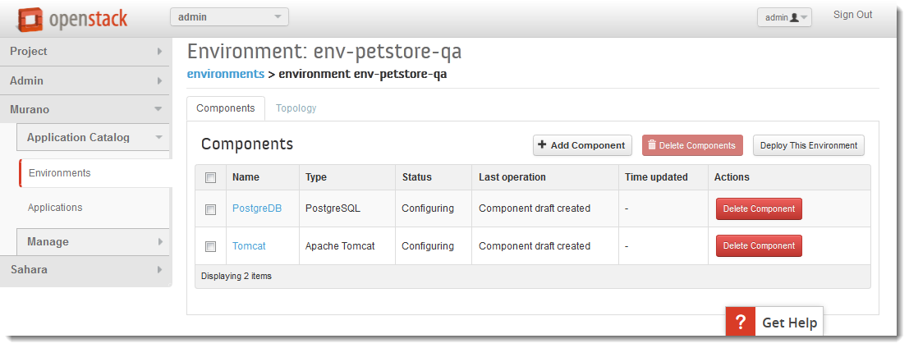
 

By this moment we have completely specified the configuration of the QA Environment, 
but nothing has been created yet.
We need to deploy the enviromnent so that to bring to life this configuration.
Let's click "Deploy The Environment" button to start the deployment.

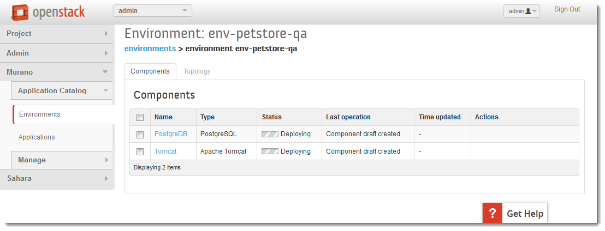

Each application moves into ``"Deploying"`` state.
All applications are being deployed in parallel.

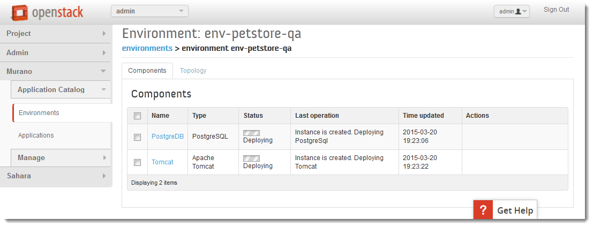

The deployment operation takes some time and while it is in progress, 
it sends the status update messages to Murano dashboard.
Murano Dashboard displays the in the "Last Operation" column.

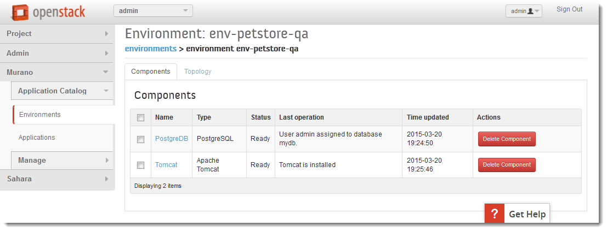

Now we have QA Tomcat and QA Postgres machines created.

Murano logs provide a complete account of what happens during deployment:

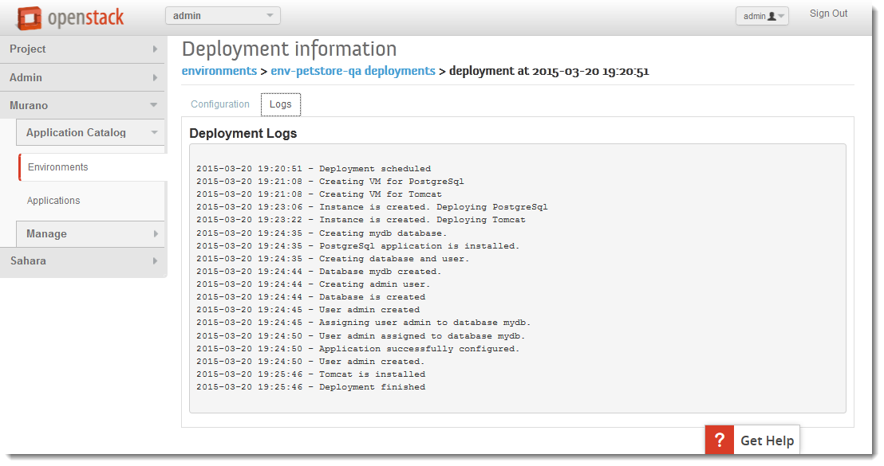

To create UAT infactructure, we need to repeat the steps for ``env-petstore-uat``:
add Tomcat and Postgres applications to it and deploy the ``env-petstore-uat`` environment.

When environments deployments are completed, you may use regular :ref:`non_murano_ui_label` to verify 
what instances has been created and how they are configured. 

Packages
~~~~~~~~

Every Murano application has a source code and resources (such as bash scripts, software binary distributives, etc.)
When the source code and other application resources are organized into specific folder structure and packaged as zip archive
this zip archive is called **Murano Package**.  

Murano Dashboard offers Package Definitions tab, that allows to manage Murano Packages. 
This is the interface for Application Publisher and Catalog Administrator.

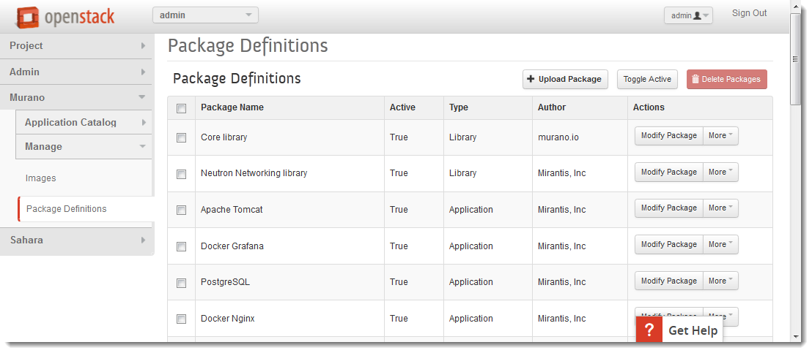

Package definition panel has a button "Upload Package"
You can create your own Murano application, package it as zip archive and upload to Murano.
As soon as an application is uploaded, it is available in the Application Catalog.

The Package Definitions tab allows you to download any package as well. 
This is especially useful if you are beginner Murano developer, 
because you may analyse the source code of every application and create your own application 
based on the complex one already present in the catalog. 

Some useful (and reusable) Murano application can be found on github site:
https://github.com/stackforge/murano-apps

For more information about packages, read :ref:`what_is_inside_package_label`

.. _images_label:

Images
~~~~~~

As Murano orchestrates creation and configuration of an instance, 
Murano needs to interact with it. 

There are several ways to achieve this. 
The most popular is  **murano-agent** - software component that resides on an instance and 
listens to Murano RabbitMQ queue. 
The other less popular ways to interact with an instance are Heat agents 
(if an application relies on Heat software orchestration), 
or an arbitrary bootstrap script, injected to an instance. 

The most common way to ensure that an instance has murano-agent is to pre-install
murano-agent on an image of a virtual machine.
That's why if a Murano application offers you to select an image and you do not know the implementation details, 
always assume that you need an image with pre-installed murano agent.

Images panel displays all the images related to Murano:

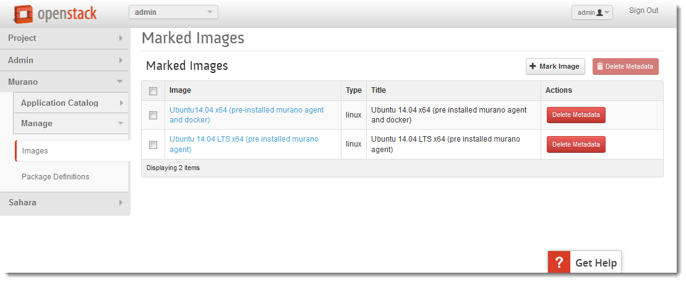

All the image-related activities on Murano-enabled images should be performed via Glance interface 
exaclty the same way as it is performmed on all other images.
 
The only functionality offred by Image panel is to mark/ unmark an image as Murano image, and 
to tag a Murano image as a ``linux`` or ``windows``.
Technically this is done by addind/removing special metadata to an image. 

Future releases of Murano will offer more fine-grain tags 
so that to distinguish between different linux and windows operating families.

.. _non_murano_ui_label:

Non-Murano UI related to Murano
~~~~~~~~~~~~~~~~~~~~~~~~~~~~~~~

Instances
_________

After your environment is deployed, you may use regular Horizon UI so that to verify what instances were created.

Go to Project -> Compute -> Instances

The screenshot below displays instances created by Deployment of QA environment:

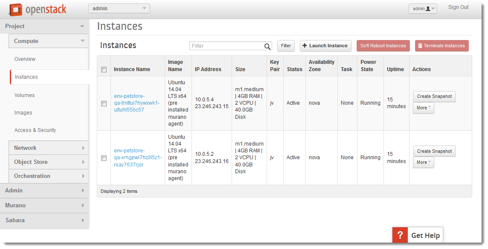

When both QA and UAT environments are deployed, you will see 2 more instances:

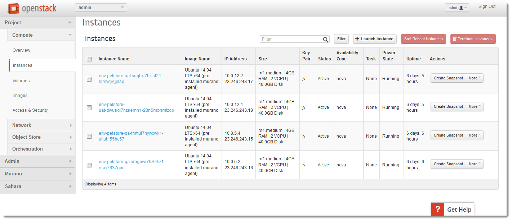

Network Topology
________________

The other interesting panel is Network Topology (Project -> Network -> Network Topology). 
After both QA and UAT environments are deployed, you will see network topology which is similar to this:

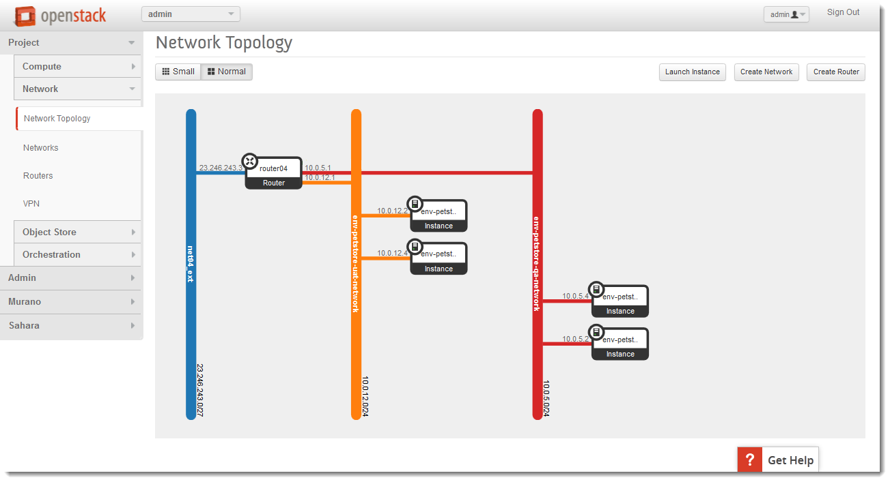

Note that QA and UAT machines share different subnets.

Stacks
______

As Murano uses Heat to provision OpenStack resources, you may review Heat UI to get the idea of what OpenStack entities were created when you deployed your environment.
It is the Stacks panel (Project -> Orchestration -> Stacks)

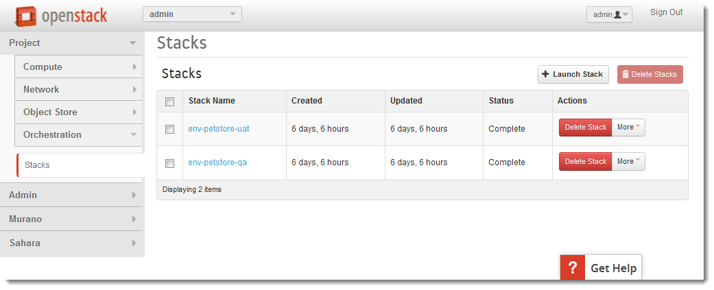

 

Murano vs. Heat
---------------

Murano translates the source code of a package into Heat Orchestration template.
It is Heat Orchestartions template that is executed when you deploy Murano application.

When should I prefer Murano over Heat? 

Firstly, if you have little experience with Openstack, you may profit from the fact that 
you do not have to know which particular Heat template do you need.
Murano offers application search, which includes search by category, tag and full-test search.
The sample values of Categories and Tags: Web, Databases, Application Servers, Big Data, Load Balances, etc.
Each application is a tested piece logic that not only installs required software component, but also performs all the 
implied instance configuration (such as to ensure that you will be to access HTTP port 8080 if you provisioned Tomcat instance)
All these security configurations are transparent to you.

Secondly, Murano Applications are portable accross different clouds, while Heat templates are designed for specific cloud. 
Heat template may reference OpenStack resources by their IDs, which requires template modification for every particular site.
Murano is a higher-level language, than Heat. It does a lot of automation and makes low-level details transparent to an application developer.   

Thirdly, Murano provides actions.
They allow you to modify deployment configuration after application is deployed.
Read more on actions here: http://openstack.10931.n7.nabble.com/Glance-Heat-Murano-split-dsicussion-td49855.html
and here: https://www.mirantis.com/blog/seeing-murano-actions-action/                                                                                                                                      

And lastly, as a Software Engineer you would favor Murano over Heat templates 
for any  progranning task where you would favor imperative programming language over declarative programming language.
Imperative program contains list of instructions. They are executed one by one from the first to the last and produce desired result.
Imperative programming languages are Java, C,... and MuranoPL. 

Declarative program describes what should be the results, but does not specify the order of execution.
SQL "SELECT FROM WHERE <boolean condition>" query, puppet manifest,... and Heat template are declarative programs. 
The weak point of a declarative program is a dependency management. You cannot just write "give me an instance and rpm  installed".
You need to specify that you install rpm only after the instance is created. I.e. that rpm installation "depends on" instance creation.
It is not a big deal for a small program, but quickly becomes a daunting task as you program increases in size. 

For more details see section :ref:`murano_vs_heat_extensive_example_label` (To be done)

.. _what_is_inside_package_label:

What is inside Murano package?
------------------------------

The structure of a Murano package is::

   ..
   |_  manifest.yaml
   |
   |_  Classes
   |   |_  MyApplication.yaml
   |
   |_  Resources
   |   |_  DeployMyApplication.template
   |   |_  scripts
   |       |_installer.sh
   |       |_setenv.sh 
   |
   |_  UI
   |   |_  ui.yaml
   |
   |_  logo.png
   
   
**manifest.yaml**
  This file is an entry point to the package. 
  It contains the general information about the appplication such as name, author and description.
  This file is in YAML format. 
  
  Almost all Murano application files are based on YAML format.
  The YAML itself is beyond this tutorial, you may read about YAML in wikipedia http://en.wikipedia.org/wiki/YAML, 
  and on official YAML site http://yaml.org/

**Classes** 
  This folder contains Murano templates written in *MuranoPL* language.  
  
  They define properties and methods of application components.
  MuranoPL language is based on YAML format too.
  Class methods contain references to the application plans in Resources folder (see below), which control installation process on a virtual machine.

**Resources**
  This folder contains the execution plans and any arbitrary files.
  
  Very simply put, **execution plan** is a wrapper around sh script.
  You pass control to this wrapper when you need to execute *.sh script.
  Execution plans are written in a specific format based on YAML.
  
  Besides execution plans, this folder may contain any application resources such as config, properties, localization files. It may even contain heat templates.

**Resources/scripts**
  This folder contains executable scenarios that are used by execution plans.
  
  Usually the are any executable files that can be run on the operating system you have chosen for your instances.
  For example, unix .sh scripts.

**UI**
  This folder contain a description of the UI form for your application. 
  
  The description of UI forms  are written in a special format, based on YAML.
  UI form will be rendered into html popup window, 
  where you will be able to pass parameters for your application.

**logo.png**
  It is a logo of your application.
  
  It is displayed on Murano dashboard. The file is recommended, but not required.
  Please note, that only png format is supported.

This folder structure must be packaged into zip archive ``<MyApplication>.zip``

This tutorial gets into more details of what is inside ``*.yaml`` and ``*.template`` files 
in the next chapter: :ref:`simple_vm_application_label`.

Discening reader may inquire, where to put binaries. Georgiy Okrokvertskhov explains this in his blog article:  
http://muranohints.blogspot.com/2015/03/murano-sending-files-to-vm.html

What to read next?
------------------

* YAML in wikipedia: http://en.wikipedia.org/wiki/YAML
* YAML official site: http://yaml.org/
* Demo application and its source code explained:  :ref:`simple_vm_application_label`

General Murano docs

* The main site of Murano documentation: http://murano.readthedocs.org/en/latest/
* Openstack wiki for Murano: https://wiki.openstack.org/wiki/Murano
* Murano applications in github: https://github.com/stackforge/murano-apps
* Openstack wiki for Heat https://wiki.openstack.org/wiki/Heat
* Murano Integration with Heat Orchestration Templates: https://www.youtube.com/watch?v=oRD3ihwa9u4 
* Georgiy Okrokvertskhov's blog for advanced Murano tips and tricks: http://muranohints.blogspot.com/

 