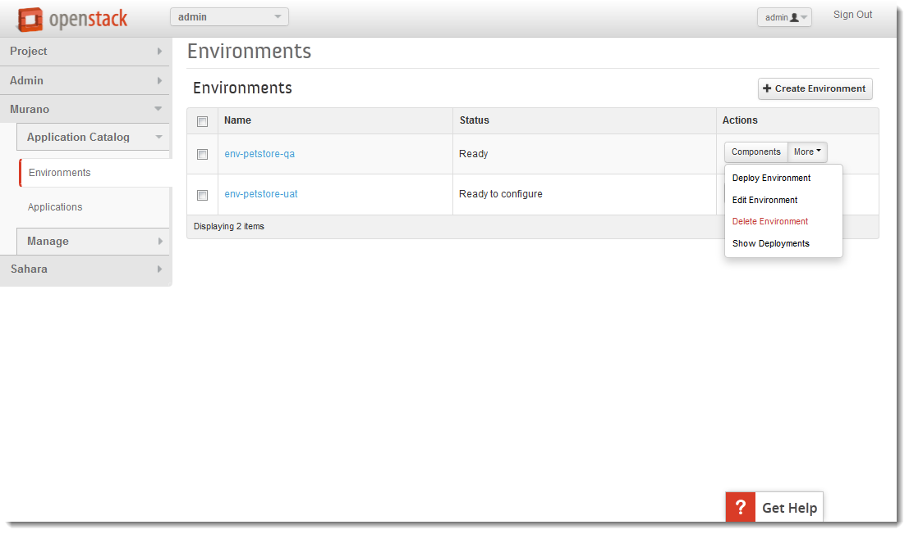
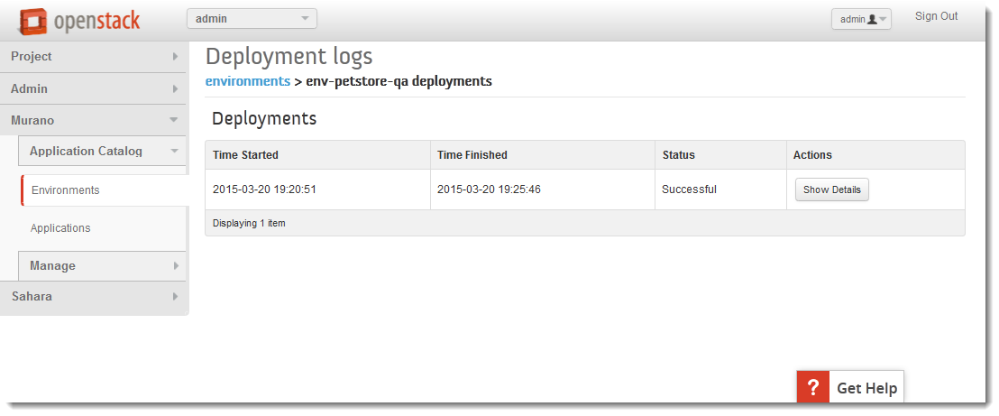

Murano Overview
===============
 
Introduction
------------
.. todo:: Move css that fixes text width into css stylesheet

.. raw:: html

    

Murano is an application catalog project on OpenStack. This project is completely open source and managed
according OpenStack community rules.

.. note:: **Murano mission statement from OpenStack wiki**

   The Murano Project introduces an application catalog to OpenStack, enabling application developers and cloud
   administrators to publish various cloud-ready applications in a browsable categorized catalog.
   Cloud users can then use the catalog to compose reliable application environments with the push of a button.

The key goal is to provide UI and API which allows to compose and deploy composite environments on the Application
abstraction level and then manage their lifecycle. Murano is focused on user experience and provides an easy way to
browse application catalog, find and filter applications in it by browsing via categories or by using free text search.

Murano UI Overview
------------------

Applications
~~~~~~~~~~~~

The main Murano UI page is an Application Catalog page where users can browse applications available for the tenant.
**Murano application** is a set of application binaries, scripts, workflows and UI definitions to install and manage an
arbitrary software like Tomcat, MySQL, Windows ActiveDirectory  on top of VM or on a bare metal server. Workflows
usually contain a set of instructions to provision OpenStack resources: VMs, networks, subnets, floating IPs and volumes.
As soon as infrastructure resources are provisioned Murano workflows will orchestrate software components installation.
It is important to note that Heat is used for OpenStack resource provisioned and it also can be used for software
components installation via Heat Software orchestration.

.. image:: images/applications.png

Each application tile has an icon, a name, short description and detailed information. There are also two buttons on each 
application tile which defines actions which you can immedeately do with the application. 
Details link leads to the detailed application description page where users can find more information about the application.

Let's take a look at the Details page of ``Tomcat`` application:
This application is responsible for creating a new instance, configuring its security group rules, and installing Tomcat on it. 

.. image:: images/tomcat_details.png

The most interesting parts of it are ``Categories: Web`` and ``Tags: Servlets, Server, Pages, Java``

Both application Categories and Tags are a markers, which you can search an application by.
The difference between them is that Tags are set by Application developer, 
while Categories are managed by Murano Administrator.

For example if you need a database, you may search the Application catalog by the category 'Database'.
The search may return such applications as MySQL, PostgreSQL, etc.

The full list of Categories is:

.. image:: images/qa_env_categories.png

Environments
~~~~~~~~~~~~

**Environment** is a set of applications managed by a single tenant. 
Appplications within single environmanet may comprise complex configuration, 
while applications in different environmetns are always independent from each other.
Environment is a logical agregation of multiple applications that binds them together.

The best way to understand what environment is, is it to look at the example. 

*Let's say that we have a QA team that needs to test famous Petstore web-application. 
Petstore needs to be deployed on a Web Server, such as Tomcat. It also stores and retrieves data from
a database, such as PostgreSQL. QA team performs weekly tests on in-development version 1.1.X: 
Petstore_SNAPSHOT_1.1.X.war.*

*Let's suppose that we also have a UAT group of end users.
UAT group is going to work with a stable release of Petstore v. 1.0: Petstore_RELEASE_1.0.war for duration of a month 
and provide a feedback about user experience.*

In a situation like that, we need to have two separate installations of Petstore. 
QA team needs their own QA infrastructure that consists of dedicated Tomcat and PostgreSQL servers.
UAT team needs separate from QA, independent infrastructure, that also consists of Tomcat and PostgreSQL servers.

While QA Tomcat interacts with QA PostgreSQL, QA servers are unaware of UAT servers, and vice versa.
QA and UAT infrastructures are completely independent from each other.

In the situation like that we will create two Murano environments: one for QA, the other one for UAT.

Environments panel has a "Create environment" button, that creates environments. 

.. image:: images/environments.png

* ``env-petstore-qa`` is a QA environment
* ``env-petstore-uat`` ia a UAT environment

At this stage these environments are mere configuration within Murano.

You may click on the name the environment to view what applications it consists of. 
Newly created environment is empty. It has nothing except for its name. 

.. image:: images/qa_env_empty.png

Once the environment is created, we can add both Tomcat and PostgreSQL applications to it.
Click on the "Add Component" button, and select Tomcat application, and enter parameters for Tomcat application.
These parameters vary from application to applcation. Most of the applications ask name, instance flavor, 
instance image, etc. Database will probably ask you to set the username and password.  

.. image:: images/add_tomcat_1.png

.. warning:: Always select instance image that comes with pre-installed murano agent. Read more on this here: :ref:`images_label` 

Usually the name of the image itself implies that it is Murano-ready, as it is shown in the screenshot below.
The image we use for the example is *"Ubuntu 14.04 LTS x64 (pre installed murano agent)"*

.. image:: images/add_tomcat_2.png

Once Tomcat and PostgresQL applications are added to the env-petstore-qa, the state of its components is ``"Configuring"``:

.. image:: images/qa_env_pre_deploy.png
 

By this moment we have completely specified the configuration of the QA Environment, 
but nothing has been created yet.
We need to deploy the enviromnent so that to bring to life this configuration.
Let's click "Deploy The Environment" button to start the deployment.

.. image:: images/qa_env_deploy_inprogress.png

Each application moves into ``"Deploying"`` state.
All applications are being deployed in parallel.

.. image:: images/qa_env_pre_deploy_2.png

The deployment operation takes some time and while it is in progress, 
it sends the status update messages to murano dashboard.

.. image:: images/qa_env_pre_deploy_complete.png

Now we have QA Tomcat and QA Postgres machines created.

To create UAT infactructure, we need to repeat the steps for ``env-petstore-uat``:
add Tomcat and Postgres applications to it and deploy the ``env-petstore-uat`` environment.

When environments deployments are completed, you may use regular :ref:`non_murano_ui_label` to verify 
what instances has been created and how they are configured. 

Packages
~~~~~~~~

Every Murano application has a source code and resources (such as bash scripts, software binary distributives, etc.)
If the source code and the resources are organized into specific folder structure and packaged as zip archive
this zip archive is called **Murano Package**.  

Murano Dashboard offers Package Definitions tab, that allows to manage Murano Packages. 
This is the interface for application publisher and catalog administrator.

.. image:: images/packages.png

Package definition panel has a button "Upload Package"
You can create your own Murano application, package it as zip archive upload to Murano.
Once uploaded,  your application is immediately availale in the application catalog. 

This interface allows you to download any package as well. 
This is a very useful if you are starting to develop your own application, because 
you may look how every application is done and create your own application based on the complex application 
that is already present in the catalog.

For more information about packages, read :ref:`what_is_inside_package_label`

.. _images_label:

Images
~~~~~~

Every instance (aka virtual machine) that is created by Murano Application, must me Murano-aware.
It must have a special Murano component called Murano agent installed on it.

.. todo:: verify That's why Murano provides build-in Operationg System images that have pre-installed murano agent. 

If a Murano application offers you to select an image, it is obligatory to select an image that has murano agent.

Images panel displays all the Murano-enabled images:

.. image:: images/images.png

All the image-related activities on Murano-enables images should be performed via Glance interface 
exaclty the same way as it is performmed on all other images. 
The only functionality offred by Image panel is to mark/ unmark an image as Murano image.
Technically this is done by addind/removing special metadata to an image. 

.. _non_murano_ui_label:

Non-Murano UI related to Murano
-------------------------------

Instances
~~~~~~~~~

After your environment is deployed, you may use regular Horizon UI so that to verify what instances were created.

Go to Project -> Compute -> Instances

The screenshot below displays instances created by Deployment of QA environment:

.. image:: images/qa_instances.png

When both QA and UAT environments are deployed, you will see 2 more instances:

.. image:: images/qa_uat_instances.png

Network Topology
~~~~~~~~~~~~~~~~

The other interesting panel is Network Topology (Project -> Network -> Network Topology). 
After both QA and UAT environments are deployed, you will see network topology which is similar to this:

.. image:: images/network_topology.png

Note that QA and UAT machines share different subnets.

Stacks
~~~~~~

The Stacks panel will give you a complete report of all the entities created in OS when you deployedyour environment.

.. image:: images/stacks.png

 
 
| on Murano topology page

.. image:: images/qa_env_deployment_logs.png

Murano vs. Heat
---------------

Murano translates the source code of a package into Heat Orchestration template.
It is Heat Orchestartions template that is executed when you deploy Murano application.

When should I prefer Murano over Heat? 

Firstly, if you have little experience with Openstack, you may profit from the fact that 
you do not have to know which particular Heat template do you need.
Murano offers application search, which includes search by category (aka tag).
These are: Web, Databases, Application Servers, Big Data, Load Balances, etc. just to name a few.
Each application is a tested piece logic that not only installs required software component, but also performs all the 
implied instance configuration (such as to ensure that you will be to access HTTP port 8080 if you provisioned Tomcat instance)
All these security configurations are transparent to you.

Secondly, Murano provides actions.
They allow you to modify deployment configuration after application is deployed.
Read more on actions here: http://openstack.10931.n7.nabble.com/Glance-Heat-Murano-split-dsicussion-td49855.html
and here: https://www.mirantis.com/blog/seeing-murano-actions-action/                                                                                                                                      

And lastly, as a Software Engineer you would favor Murano over Heat templates 
for any  progranning task where you would favor imperative programming language over declarative programming language.
Imperative program contains list of instructions. They are executed one by one from the first to the last and produce desired result.
Imperative programming languages are Java, C,... and MuranoPL. 

Declarative program describes what should be the results, but does not specify the order of execution.
SQL "SELECT FROM WHERE <boolean condition>" query, puppet manifest,... and Heat template are declarative programs. 
The weak point of a declarative program is a dependency management. You cannot just write "give me an instance and rpm  installed".
You need to specify that you install rpm only after the instance is created. I.e. that rpm installation "depends on" instance creation.
It is not a big deal for a small program, but quickly becomes a daunting task as you program increases in size. 

For more details see section :ref:`murano_vs_heat_extensive_example_label`

.. _what_is_inside_package_label:

What is inside Murano package
-----------------------------

The structure of a Murano package is::

   ..
   |_  manifest.yaml
   |
   |_  Classes
   |   |_  MyApplication.yaml
   |
   |_  Resources
   |   |_  DeployMyApplication.template
   |   |_  scripts
   |       |_installer.sh
   |       |_setenv.sh 
   |
   |_  UI
   |   |_  ui.yaml
   |
   |_  logo.png
   
   
**manifest.yaml**
  is an entry point to the package. It is in yaml format and contains the general information
  about the appplication such as name, author and description

**Classes** 
  folder contains Murano templates written in *MuranoPL* language. They
  define properties and methods of application components.

  Class methods contain references to the application plans, which control installation process on a virtual machine.

**Resources**
  folder contains these application plans.

**Resources/scripts**
  folder contain  executable scenarios that are used by execution plans.

**UI**
  folder contain a description of the UI form for your application. UI form will be rendered into html popup window, 
  where you will be abple to pass parameters for your application.

**logo.png**
  in a logo of your application.  It is displayed on Murano dashboard. The file is recommended, but not required.

This folder structure must be packaged into zip archive ``<MyApplication>.zip``

We will get into more details of what is inside ``*.yaml`` and ``*.template`` files 
in the next chapter: :ref:`simple_vm_application_label`.

Further Reading
---------------

.. todo:: give links to the next chapters

 