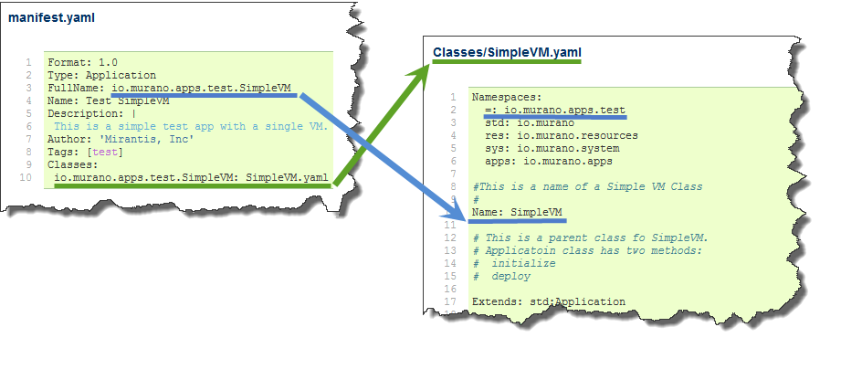

.. _simple_vm_application_label:

Demo Application: Simple VM
---------------------------

.. #todo:: Move css that fixes text width into css stylesheet

.. raw:: html

    

What is Simple VM?
~~~~~~~~~~~~~~~~~~

This tutorial uses a demo application called **Simple VM** to demonstrate how to create you own Murano Application.
This section will walk you through the source code of Simple VM line-by-line and then explain how to upload, deploy and test it.

Simple VM is a very basic application: it creates instance and provides an action that can restart it through Murano Dashboard.
It does not install any software on the VM instance it provisions. 
Such an over-simplification is unusual, but it lets to explain every principle of design without blowing up this tutorial to an enormous size.
Later we will show, how to extend Simple VM to make it install Tomcat on VM instance it provisions. 

The source code of Simple VM is developed by Georgy Okrokvertskhov and available on github:   
https://github.com/gokrokvertskhov/murano-trainings/tree/master/Day_1/io.murano.apps.test.SimpleVM

Simple VM Code Explained
~~~~~~~~~~~~~~~~~~~~~~~~

.. _what_is_inside_simple_vm_label: 

What is inside?
_______________

The package structure of Simple VM is::

  ..
   |_  manifest.yaml
   |
   |_  Classes
   |   |_  SimpleVM.yaml
   |
   |_  Resources
   |   |_  Restart.template
   |   |_  scripts
   |       |_restart.sh
   |
   |_  UI
   |   |_  ui.yaml
   |
   |_  logo.png
   
   
The structure of the typical Murano Application is described here: :ref:`what_is_inside_package_label`

If you go by this link, and compare the content of Simple VM with the typical content of typical Murano application, 
you will see that it does not have the equivalent of ``Resources\DeployMyApplication.template``
This is because Simple VM does not install any software on the VM instance it creates.
That's why there is no any .sh script that would install software and consequently there is no template for install script in Resouces folder.
On the other hand, Simple VM provides a ``Restart`` action, which is available at Murano Dashboard.
The logic of Restart action is placed in Restart.template and restart.sh.
The Resources that implement an action are very similar to the resources that perform initial software intallation.
That's why this tutorial explains how to write resources by example of an action. 
Later we will show, how to extend SimpleVM to install Tomcat on VM instance it provisions.

.. topic:: How does the package structure changes if I want SimpleVM install Tomcat?
  
  **Answer:** You will have more files in Resource and Resource/scripts folder. 
  You will add an sh script that installs Tomcat, say, *Resources/scripts/install_tomcat.sh*
  and a template file for this script, say, *Resources/InstallTomcat.template*
   

.. topic:: How do I update existent SimpleVM files if I want to install Tomcat?
  
  **Answer:** This is explained later in this document for each file. Follow *"Explained Line-by-Line"* links. 
  *Resources/scripts/install_tomcat.sh*  and  *Resources/InstallTomcat.template* are explained in the section 
  for *Resources/Restart.template* 
    

manifest.yaml
_____________

**manifest.yaml**

.. code-block:: yaml
   :linenos:
   :lineno-start: 1   

   Format: 1.0
   Type: Application
   FullName: io.murano.apps.test.SimpleVM
   Name: Test SimpleVM
   Description: |  
    This is a simple test app with a single VM.
   Author: 'Mirantis, Inc'
   Tags: [test]
   Classes:
    io.murano.apps.test.SimpleVM: SimpleVM.yaml

Source code may be downloaded from here: 
https://github.com/gokrokvertskhov/murano-trainings/blob/master/Day_1/io.murano.apps.test.SimpleVM/manifest.yaml

This is a manifest file. It contains general information about the application.
It is very similar to the manifest of a jar archive.
It has a fixed format based on YAML (this is not MuranoPL).

It indicates what Murano classes comprise the SimpleVM application 
and what is the entrance point to the application (i.e. What is the 'main' class?)
This is achieved by two key properties: ``FullName`` and ``Classes``

The property ``FullName`` specifies the full name of the *'main'* SimpleVM class: ``io.murano.apps.test.SimpleVM``.

The property ``Classes`` specifies where to find the *'main'* class: ``Classes\SimpleVM.yaml``

Please consult the picture below (click on the image to enlarge it):

   
   
For more details please consult:  :ref:`manifest_yaml_explained_label` 
This link provides detailed explanation of the source code of manifest.yaml.
It also covers naming convention for Murano classes and describes the implications of the fact that the syntax is based on YAML.

 
.. _simple_vm_yaml_label:

Classes/SimpleVM.yaml
_____________________

**Classes/SimpleVM.yaml**

.. code-block:: yaml
   :linenos:
   :lineno-start: 1   

   Namespaces:
     =: io.murano.apps.test
     std: io.murano
     res: io.murano.resources
     sys: io.murano.system
     apps: io.murano.apps
   
   #This is a name of a Simple VM Class
   #
   Name: SimpleVM
   
   # This is a parent class fo SimpleVM.
   # Applicatoin class has two methods:
   #  initialize
   #  deploy
   
   Extends: std:Application
   
   Properties: 
     name:
       Contract: $.string().notNull()  
       
     instance:
       Contract: $.class(res:Instance).notNull()
            
     host:
       Contract: $.string()
       Usage: Out
   
     user:
       Contract: $.string()
       Usage: Out
   # Workflow section is deprecated
   # Use Methods instead.
   #Workflow:
   Methods:
     initialize: 
       Body: 
         - $.environment: $.find(std:Environment).require()
   # This is a deploy method for our new app
   # This method will be called from Environment class method deploy.
     deploy:
       Body:
         # Attributes are runtime properties which are not visible to the user.
         # Use attributes to store some internal data between deployments.
         # Attributes data is persistent. It is stored as a part of Object Model.
         # $.getAttr(name, default_value) - gets attribute from the Object model
         # $.setAttr(name, value) - store attribute value in the Object Model
         # Only basic types are supported (boolean, int, string)
         - If: not $.getAttr(deployed, false)
           Then:
             # This is a log method to send status log message back to UI
             # This is what users will see in the UI during deployment time
   
             - $.environment.reporter.report($this, 'Creating a VM ')
   
             # Security groups object is a list of dicts [{}]
             # each dict element in this list should have following key:value entries:
             #  FromPort: value - lower boundary of the port range
             #  ToPort: value - upper boundary of the port range
             #  IpProtocol: <tcp|udp> - transport protocol type TP or UDP
             #  External: <true|false> 
             #     - if true it opens for CIDR:0.0.0.0/0
             #       if false it opens port only for SecGroup members
             - $securityGroupIngress:
                 - ToPort: 22
                   FromPort: 22
                   IpProtocol: tcp
                   External: True true is more correct
             - $.environment.securityGroupManager.addGroupIngress($securityGroupIngress)
             # Now lets ask our instance to deploy itself.
             # Inside deploy method there are additional steps which configure networks
             - $.instance.deploy() 
             - $.environment.reporter.report($this, 'The new VM is created')
             # Save host information to local variables
             - $.host: $.instance.ipAddresses[0]
             - $.user: 'root'
             # Format log message based on variables values
             - $msg: format('{0}@{1}', $.user, $.host)
             - $.environment.reporter.report($this, 'The VM is available ' + $msg)
             - $.setAttr(deployed, true) True is string, its ia a bug, bool is true
   
     restartVM:
       Usage: Action
       Body:
         - $.environment.reporter.report($this, 'Restarting the VM')
         # Create new Resources class to have an access to the package resources
         # Package resources are stored in Resource folder
         - $resources: new(sys:Resources)
         # Load yaml file with execution plan. 
         # Bind execution plan parameters with actual values.
         - $command: $resources.yaml('Restart.template').bind(dict(
             time => 'now'
             ))
         # Send execution plan to the agent on the instance
         - $.instance.agent.call($command, $resources)
         - $.environment.reporter.report($this, 'Restart command was sent to VM')
   

Source code may be downloaded from here: 
https://github.com/gokrokvertskhov/murano-trainings/blob/master/Day_1/io.murano.apps.test.SimpleVM/Classes/SimpleVM.yaml

SimpleVM.yaml is the heart of the SimpleVM application. It defines the logic that creates VM instance 
and the logic that perforrms restartVM action on the VM instance.

The structure of the class is following:

.. raw:: html

   <table>
   <tr>
   <td>
   <pre class="sample">   
   
   Namespaces:
     # NAMESPACES DEFINITIONS HERE
     
   Name: SimpleVM
     # CLASS NAME
      
   Extends: std:Application
     # BASE CLASS INHERITANCE
     
   Properties: 
     # SPECIFIES IN AND OUT PROPERTIES HERE

   Methods:
     initialize: 
       Body: 
         # DEFINES CONSTUCTOR LOGIC HERE

     deploy:
       Body:
         # DEFINES LOGIC THAT CREATES VM INSTANCE
         # IF YOU NEED TO EXTEND SIMPLEVM TO INSTALL SOFTWARE ON VM INSTANCE
         # ADD THIS LOGIC HERE
   
     restartVM:
       # THE NAME OF THE ACTION
       Usage: Action
       Body:
         # DEFINES LOGIC THAT PERFORMS VM RESTART
         
   </pre>
   </td>
   </tr>
   </table>
   

All the magic that creates VM instance happens inside ``deploy`` method.  
If you need to install any software on the VM instance or perform any 
arbitrary initial configuration of it, this logic should be placed in ``deploy`` method as well.

The method ``restartVM`` defines the logic that performs restart of VM instance. 

If you need to add more actions to SimpleVM, add them similar to ``restartVM``:

.. raw:: html

   <table>
   <tr>
   <td>
   <pre class="sample">   

     ...
     
     deploy:
       Body:
         ...
   
     restartVM:
       Usage: Action
       Body:
         ...
      
     newActionName:
       Usage: Action
       Body:
         ...
         
     ....
         
   </pre>
   </td>
   </tr>
   </table>

The ``Properties`` clause specifies the properties of SimpleVM. Such things as VM instance name, 
the name of the image that will be used to install an operationg system on the VM instance, etc. -
are passed here.  There are arbitrary ways to pass these parameters to a Murano PL class. In case of SimpleVM they are
passed from UI form. (See below)

If ``deploy`` method or an action need to pass and execute arbitrary executable script on the VM instance, 
(for example in order to install a software or perform an arbitrary configuration on VM instance)
they instantiate Resource object, initialize it with the appropriate resource.yaml file and send for 
execution via the agent call.

This is similar to ``restartVM`` action: 

.. raw:: html

   <table>
   <tr>
   <td>
   <pre class="sample">   
 
         - $resources: new(sys:Resources)
         - $command: $resources.yaml('Restart.template')
         - $.instance.agent.call($command, $resources)

   </pre>
   </td>
   </tr>
   </table>

The detailed explanation of all the code of SimpleVM including work with resources is available here:
:ref:`simple_vm_yaml_explained_label` 

For more reference please consult this short tutorial on Murano PL available here: 
https://wiki.openstack.org/wiki/Murano/DSL/Blueprint
It is generally OK, but a bit dated.

Resources/Restart.template
__________________________

**Resources/Restart.template**

.. code-block:: yaml
   :linenos:
   :lineno-start: 1   
     
   FormatVersion: 2.0.0
   Version: 1.0.0
   Name: Restart VM
   
   Parameters:
     time: $time
   
   
   Body: |
     return restart(args.time).stdout
   
   Scripts:
     restart:
       Type: Application
       Version: 1.0.0
       EntryPoint: restart.sh
       Files: []
       Options:
         captureStdout: true
         captureStderr: true
      
      
Source code: 

https://github.com/gokrokvertskhov/murano-trainings/blob/master/Day_1/io.murano.apps.test.SimpleVM/Resources/Restart.template

The detailed explanation is available here: :ref:`restart_template_explained_label`.

In short, the main purpose of Restart.template is to make restart.sh accessible from MuranoPL code and to pass ``$time`` parameter to it.
The sole purpose of passing this parameters to ``restart.sh`` is just to demonstrate how to do it.

 
Resources/scripts/restart.sh
____________________________

**Resources/scripts/restart.sh**

.. code-block:: bash
   :linenos:
   :lineno-start: 1   

   #!/bin/bash
   shutdown -r $1

Source code: https://github.com/gokrokvertskhov/murano-trainings/blob/master/Day_1/io.murano.apps.test.SimpleVM/Resources/scripts/restart.sh

Please note that Murano-agent executes bash scripts as a root user. This is a potential security breach, so do take measures to prevent 
malitious code execution. Do not upload Murano packages of unknown or dubious origin.

UI/ui.yaml
__________

**UI/ui.yaml**

.. code-block:: yaml
   :linenos:
   :lineno-start: 1   
   
   Version: 2
   
   Application:
     ?:
       type: io.murano.apps.test.SimpleVM
     name: $.appConfiguration.name
     instance:
       ?:
         type: io.murano.resources.LinuxMuranoInstance
       name: generateHostname($.instanceConfiguration.unitNamingPattern, 1)
       flavor: $.instanceConfiguration.flavor
       image: $.instanceConfiguration.osImage
       assignFloatingIp: $.appConfiguration.assignFloatingIP
       keyname: $.instanceConfiguration.keyPair
   
   Forms:
     - appConfiguration:
         fields:
           - name: name
             type: string
             label: Application Name
             initial: Tomcat
             description: >-
               Enter a desired name for the application. Just A-Z, a-z, 0-9,
               dash and underline are allowed
           - name: assignFloatingIP
             type: boolean
             label: Assign Floating IP
             description: >-
                Select to true to assign floating IP automatically
             initial: false
             required: false
             widgetMedia:
               css: {all: ['muranodashboard/css/checkbox.css']}
     - instanceConfiguration:
         fields:
           - name: title
             type: string
             required: false
             hidden: true
             description: >-
               Specify some instance parameters on which the application 
               would be created
           - name: flavor
             type: flavor
             label: Instance flavor
             description: >-
               Select registered in Openstack flavor. Consider that application 
               performance depends on this parameter.
             required: false
           - name: osImage
             type: image
             imageType: linux
             label: Instance image
             description: >-
               Select a valid image for the application. Image should already 
               be prepared and registered in glance.
           - name: keyPair
             type: keypair
             label: Key Pair
             description: >-
               Select a Key Pair to control access to instances. You can login to
               instances using this KeyPair after the deployment of application.
             required: false
           - name: availabilityZone
             type: azone
             label: Availability zone
             description: >-
               Select availability zone where the application would be installed.
             required: false
           - name: unitNamingPattern
             label: Hostname
             type: string
             required: false
             widgetMedia:
               js: ['muranodashboard/js/support_placeholder.js']
               css: {all: ['muranodashboard/css/support_placeholder.css']}

Source code of UI/ui.yaml is available on github: https://github.com/gokrokvertskhov/murano-trainings/blob/master/Day_1/io.murano.apps.test.SimpleVM/UI/ui.yaml

The source code of UI/ui.yaml is written in YAML and it has a specific format.
The ``Forms`` clause define, what UI forms will be generated and presented to a user.
Each definition of a UI form sets, which data will be captured from the user.

The ``Application`` clause defines the values of the parameters passed to the SimpleVM.yaml class.
Please consult the picture below:

.. image:: images/SimpleVM/UI_form_to_SimpleVM_1.png
   :target: _images/UI_form_to_SimpleVM_1.png

The specification of UI form format is available here: https://wiki.openstack.org/wiki/Murano/Documentation/DynamicUI
The detailed line-to-line explanation of UI/ui.yaml is available here: :ref:`ui_yaml_explained_label`
   
How to Upload and Deploy Simple VM?
~~~~~~~~~~~~~~~~~~~~~~~~~~~~~~~~~~~

How to upload SimpleVM
______________________

To upload SimpleVM perform these steps:

**Prepare SimpleVM.zip package**

* Go to https://github.com/gokrokvertskhov/murano-trainings and click "Download Zip" button

* Extract downloaded zip
* Navigate to folder ``Day_1/io.murano.apps.test.SimpleVM`` and archive its content into zip file ``SimpleVM.zip``.
* Verify that the content of ``SimpleVM.zip`` is as described here: :ref:`what_is_inside_simple_vm_label`

**Upload SimpleVM.zip in Murano via Murano dashboard**

* Navigate to Murano -> Manage -> Package Definitions and click button "Upload Package"

* Click "Browse" button to select the location of SimpleVM.zip on your machine.
* Select appropriate application categories and click "Upload"
 

After package is uploaded, you may edit its metadata. As you see, the application name is "Test Simple VM".
This is the name specified in the manifest.yaml. Let's edit it.

* Click on "Modify Package"

Pop-up window "Modify package" appears. 

* Edit the name fiesd and click "Submit" button.

How to deploy SimpleVM
______________________

Once SimpleVM package is uploaded to Murano, you may deploy it.
Perform these steps:

**Create an environment**

* Go to Murano -> Application Catalog -> Environments
* Click "Create Environment" button

* Enter the name of the environment and click "Create" button

* Verify that the environment appear in the list of environments.

**Add Simple VM application to the Environment**

Once the environment is created, let's add SimpleVM application to it.

* Click on the name of the environment. It is a link that leads you to the Environment details page.
* Verify that the environment is empty

* Click "Add Component" button

* The next screen has a list of all available applications. Locate SimpleVM application on it. 
It should be available on top of the screen in the section of recentry used applications, because it was just aploaded.

* Click on the application tab.

* Verify the metadata of the application. These data were specified by manifest.yaml.

* Click on "Add to env" button

* Enter the name of the application that will be used to reference the application instance
* Check Assign Floating IP field
* Compare theses UI form with appConfiguration defined in UI.yaml
* Click "Next" button

* Enter the values for the fields as shown on the screenshot below except for keypair.
Use should use your own keypair so that you could login onto the machine

* Compare this UI form to the instanceConfiguration as it is defined in ui.yaml.

* Click "Next" button

* Click "Create" button. 

* Verify that the application is successfully added to the enviroment. Look out for green "Success" pop-up window that appears for several seconds.

**Deploy the Environment**

Now the environment is ready for deploy.

* On the environment details screen ckick on "Deploy The Environment" button.

* Wait until the status becomes "Ready"

* Click on the "Topology" tab so that to investigate what VM instances have been created

* Hover a mouse on the application icon and verify its details

* Hover a mouse on the instance icon and verify its datails

